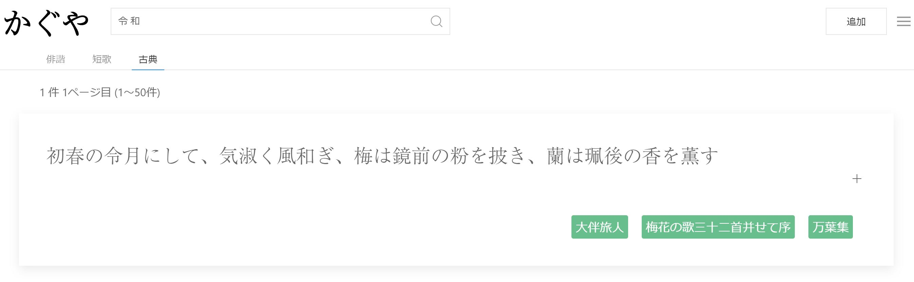

# かぐや
日本語古典資料検索システム



## 使っているもの
- Docker
- Nginx
- Django
- React.js

## 使い方
```
docker-compose build

docker-compose run react bash

(reactコンテナ内で)
    cd kaguya
    yarn install

docker-compose up
```

また、.envを作成し、内容を以下のようにしてください。
```
POSTGRES_USER=                  #PostgreSQLで使用するユーザ名
POSTGRES_PASSWORD=              #PostgreSQLで使用するパスワード
SECRET_KEY=                     #DjangoのSECRET_KEY
URL=                            #デプロイ先URL (DjangoのALLOWED_HOSTSに登録するため)
```

Adobe Fontを使用する場合は、react/kaguya/public/index.htmlの"kitId"を記入してください。

<!-- ## Respect for
かぐや様は告らせたい～天才たちの恋愛頭脳戦～ -->